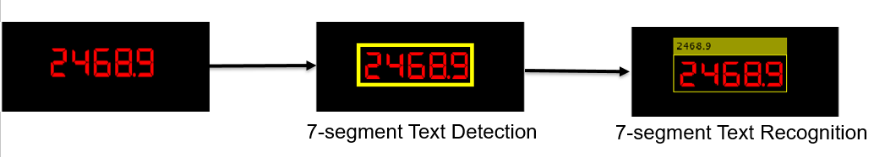

# Seven Segment Digit Recognition

This repository implements seven segment digit recognition in MATLAB&reg;.

[](https://matlab.mathworks.com/open/github/v1?repo=matlab-deep-learning/Seven-Segment-Digit-Recognition)

Requirements
------------  

- MATLAB R2021a or later
- Deep Learning Toolbox&trade;
- Computer Vision Toolbox&trade;

Overview
--------

This repository implements seven segment digit recognition using two steps. The first step detects the location of image text using a deep learning network [1]. The second stage uses the [OCR](https://in.mathworks.com/help/vision/ref/ocr.html) function from the Computer Vision Toolbox&trade; to recognize the digits. 

The two-step approach helps improve OCR by only processing image regions that contains text. This is useful in industrial automation applications where the digital displays are often surrounded by other objects and background content that can hinder the performance of OCR. 

Getting Started
---------------
Download or clone this repository to your machine and open it in MATLAB.
### Setup
Add path to the source directory.

`addpath('src','images');`

Recognize Seven Segment Digits
---------------------------------------

```
% Read image.
  orgImg = imread('sevenSeg.png');

% Pre-process the image.
  [image, imageScale] = helper.preprocess(orgImg);
  
% Detect seven segment digits.
  boundingBoxes = helper.textDetection(image,imageScale);
  
% Recognize seven segment digit using ocr.
  roi = boundingBoxes;
  txt = ocr(orgImg, roi,'TextLayout','block','Language','src/tessdata/seven-segment.traineddata');
 
% Display results.
  words = [txt(:).Words];
  orgImg = insertObjectAnnotation(orgImg,'rectangle',boundingBoxes, words);
  figure
  imshow(orgImg)
```



Algorithms
---------------------------------------
The text detection network helps in isolating seven segment digits in the image and give bounding boxes (or region of interest) as [x y width height]. This vector specifies the upper-left corner and size of a rectangluar region of interest in pixels. For more information about text detection refer to [Text Detection using Deep Learning](https://github.com/matlab-deep-learning/Text-Detection-using-Deep-Learning) GitHub repository.

For digit recognition, a custom OCR language model is trained for recognizing seven-segment digits using the [OCR Trainer app](https://in.mathworks.com/help/vision/ref/ocrtrainer-app.html#:~:text=The%20OCR%20Trainer%20app%20allows%20you%20to%20label,the%20app%20icon.%20MATLAB%20command%20prompt%3A%20Enter%20ocrTrainer.). For more information about training OCR on custom data, see [Train Optical Character Recognition for Custom Fonts](https://www.mathworks.com/help/vision/ug/train-optical-character-recognition-for-custom-fonts.html).

**Note:** To improve OCR results, see [Troubleshoot ocr Function Results](https://in.mathworks.com/help/vision/ug/troubleshoot-ocr-function-results.html).

References
---------------------------------------
[1] Baek, Y., Lee, B., Han, D., Yun, S. and Lee, H., 2019. Character region awareness for text detection. In Proceedings of the IEEE/CVF Conference on Computer Vision and Pattern Recognition (pp. 9365-9374).

See Also
------------------------------------
[Text Detection using Deep Learning](https://github.com/matlab-deep-learning/Text-Detection-using-Deep-Learning)

Copyright 2021 The MathWorks, Inc.
